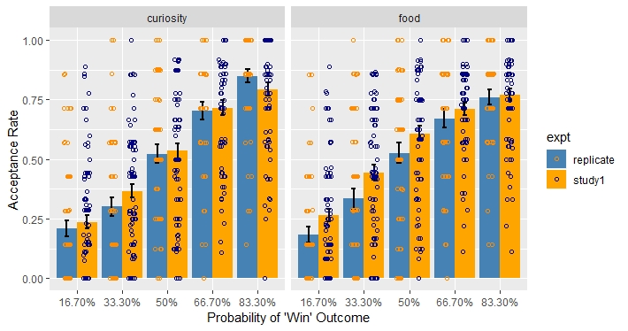

# Simple Barplot with error bars & data points using ggplot2

This script (Markdown file) was writen to share what I find useful from my experience when plotting a simple (bar)chart on data with more than two factors, using ggplot. The plot includes visualisation of error bars and raw data points. Note: there would be better and more advanced scripts out there if that’s what you are looking for.

In this example, I am using some data from two experiments included in this project: https://www.biorxiv.org/content/10.1101/473975v1

The plot to be created shows the effect of different factors on individual’s acceptance/risk-taking rate

In the included .csv file here, each row contains data from a single trial. The column ‘expt’ specifies from which experiment the trial comes from,‘study1’ or ‘replicate’ In column ‘choice’: ‘1’ refers to ‘accepting a gamble/risk’; ‘0’ refers to ‘rejecting a gamble/risk’ The column ‘raw_rate’ contains the participant’s curiosity/desirability rating towards the stimulus presented in each trial (this won’t be used in the current example) The column’win_prob’ shows the probability of winning presented on a wheel of fortune in each trial
